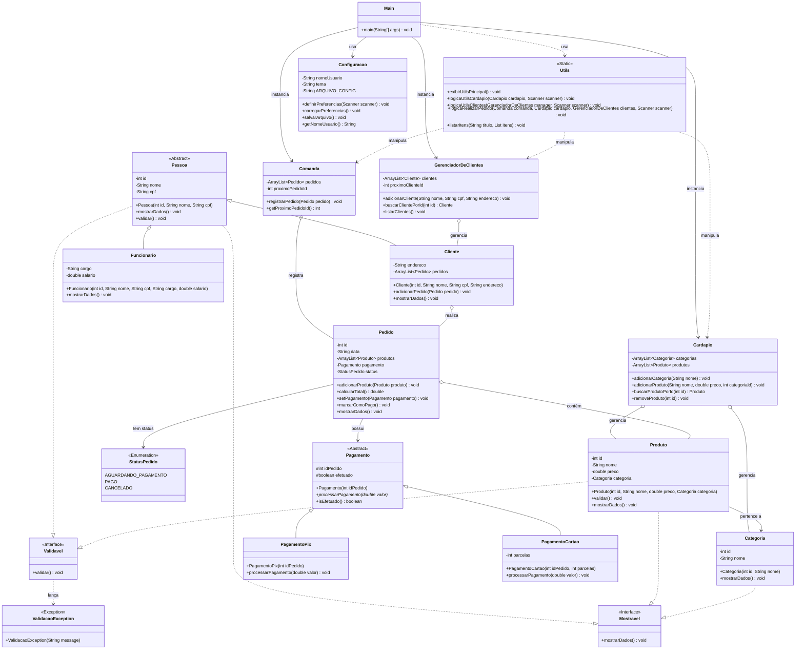

```mermaid
classDiagram
    %% Interfaces
    class Mostravel {
        <<Interface>>
        +mostrarDados() void
    }
    class Validavel {
        <<Interface>>
        +validar() void
    }

    %% Classes Principais
    class Main {
        +main(String[] args) void
    }

    class Utils {
        <<Static>>
        +exibirUtilsPrincipal() void
        +logicaUtilsCardapio(Cardapio cardapio, Scanner scanner) void
        +logicaUtilsClientes(GerenciadorDeClientes manager, Scanner scanner) void
        +logicaRealizarPedido(Comanda comanda, Cardapio cardapio, GerenciadorDeClientes clientes, Scanner scanner) void
        +listarItens(String titulo, List itens) void
    }

    class Configuracao {
        -String nomeUsuario
        -String tema
        -String ARQUIVO_CONFIG
        +definirPreferencias(Scanner scanner) void
        +carregarPreferencias() void
        +salvarArquivo() void
        +getNomeUsuario() String
    }

    class ValidacaoException {
        <<Exception>>
        +ValidacaoException(String message)
    }

    %% Core Domain - Pessoas
    class Pessoa {
        <<Abstract>>
        -int id
        -String nome
        -String cpf
        +Pessoa(int id, String nome, String cpf)
        +mostrarDados() void
        +validar() void
    }

    class Cliente {
        -String endereco
        -ArrayList~Pedido~ pedidos
        +Cliente(int id, String nome, String cpf, String endereco)
        +adicionarPedido(Pedido pedido) void
        +mostrarDados() void
    }

    class Funcionario {
        -String cargo
        -double salario
        +Funcionario(int id, String nome, String cpf, String cargo, double salario)
        +mostrarDados() void
    }

    %% Core Domain - Produtos e Cardapio
    class Categoria {
        -int id
        -String nome
        +Categoria(int id, String nome)
        +mostrarDados() void
    }

    class Produto {
        -int id
        -String nome
        -double preco
        -Categoria categoria
        +Produto(int id, String nome, double preco, Categoria categoria)
        +validar() void
        +mostrarDados() void
    }

    class Cardapio {
        -ArrayList~Categoria~ categorias
        -ArrayList~Produto~ produtos
        +adicionarCategoria(String nome) void
        +adicionarProduto(String nome, double preco, int categoriaId) void
        +buscarProdutoPorId(int id) Produto
        +removeProduto(int id) void
    }

    %% Core Domain - Pedidos e Pagamentos
    class Pedido {
        -int id
        -String data
        -ArrayList~Produto~ produtos
        -Pagamento pagamento
        -StatusPedido status
        +adicionarProduto(Produto produto) void
        +calcularTotal() double
        +setPagamento(Pagamento pagamento) void
        +marcarComoPago() void
        +mostrarDados() void
    }

    class Comanda {
        -ArrayList~Pedido~ pedidos
        -int proximoPedidoId
        +registrarPedido(Pedido pedido) void
        +getProximoPedidoId() int
    }

    class StatusPedido {
        <<Enumeration>>
        AGUARDANDO_PAGAMENTO
        PAGO
        CANCELADO
    }

    class Pagamento {
        <<Abstract>>
        #int idPedido
        #boolean efetuado
        +Pagamento(int idPedido)
        +processarPagamento(double valor)*
        +isEfetuado() boolean
    }

    class PagamentoPix {
        +PagamentoPix(int idPedido)
        +processarPagamento(double valor) void
    }

    class PagamentoCartao {
        -int parcelas
        +PagamentoCartao(int idPedido, int parcelas)
        +processarPagamento(double valor) void
    }

    class GerenciadorDeClientes {
        -ArrayList~Cliente~ clientes
        -int proximoClienteId
        +adicionarCliente(String nome, String cpf, String endereco) void
        +buscarClientePorId(int id) Cliente
        +listarClientes() void
    }

    %% Relacionamentos
    Main ..> Utils : usa
    Main --> Configuracao : usa
    Main --> Cardapio : instancia
    Main --> GerenciadorDeClientes : instancia
    Main --> Comanda : instancia

    Utils ..> Cardapio : manipula
    Utils ..> GerenciadorDeClientes : manipula
    Utils ..> Comanda : manipula

    %% Heranças e Implementações
    Pessoa <|-- Cliente
    Pessoa <|-- Funcionario
    Pessoa ..|> Mostravel
    Pessoa ..|> Validavel

    Pagamento <|-- PagamentoPix
    Pagamento <|-- PagamentoCartao

    Produto ..|> Mostravel
    Produto ..|> Validavel
    Categoria ..|> Mostravel

    Validavel ..> ValidacaoException : lança

    %% Associações e Composições
    GerenciadorDeClientes o-- Cliente : gerencia
    Cardapio o-- Produto : gerencia
    Cardapio o-- Categoria : gerencia
    Comanda o-- Pedido : registra

    Cliente o-- Pedido : realiza
    Pedido o-- Produto : contém
    Pedido --> Pagamento : possui
    Pedido --> StatusPedido : tem status
    Produto --> Categoria : pertence a
```

